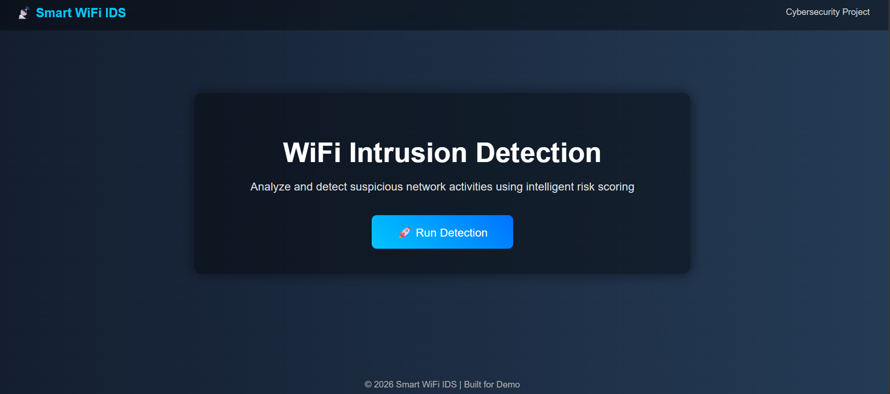
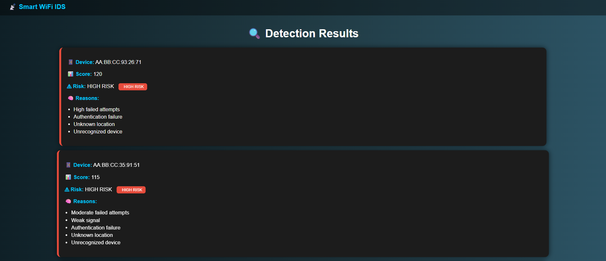

# 📡 Smart WiFi Intrusion Detection System

A simple yet effective **WiFi Intrusion Detection System (IDS)** built using Python and Flask.  
This project analyzes WiFi activity logs and detects suspicious behavior using a **risk scoring mechanism**.

---

## 🚀 Features

- 📊 Detects suspicious WiFi activities  
- ⚠ Classifies risk levels (LOW / MEDIUM / HIGH)  
- 🧠 Rule-based detection logic  
- 🔄 Dynamic data generation  
- 🌐 Web interface using Flask  
- 📄 Automated report generation  

---

## 🧠 How It Works
```
generate_data.py → creates sample WiFi events
↓
events.json → stores data
↓
detector.py → calculates risk score + reasons
↓
alerts.py → formats alerts + summary
↓
app.py → displays results (UI)
↓
report_generator.py → creates report.txt
```

---

## 🔄 Project Workflow
```
Data → Detector → Alerts → Report
```

- **Data**: stores WiFi events  
- **Detector**: calculates risk score and reasons  
- **Alerts**: assigns risk level  
- **Report**: summarizes results  

---

## 📂 Project Structure
```
Smart_Wifi_Intrusion_Detection_System/
│
├── core/
│ ├── detector.py
│ ├── alerts.py
│
├── data/
│ └── events.json
│
├── scripts/
│ └── generate_data.py
│
├── reports/
│ └── report_generator.py
│
├── templates/
│ ├── index.html
│ └── result.html
│
├── app.py
├── main.py
└── README.md
```

---

## ⚙️ Installation & Setup

### 1️⃣ Clone the repository
```bash
git clone https://github.com/your-username/Smart_Wifi_Intrusion_Detection_System.git
cd Smart_Wifi_Intrusion_Detection_System
```

### 2️⃣ Install dependencies
```bash
pip install flask
```
### ▶️ How to Run
Step 1: Generate sample data
```
python scripts/generate_data.py
```
Step 2: Run the web app
```
python app.py
```
Step 3: Open in browser
```
http://127.0.0.1:5000/
```
Click 🚀 Run Detection to view results.

---
## 📊 Risk Detection Logic

The system calculates a score based on:

- Failed login attempts
- Signal strength
- Event type (`auth_fail`, `suspicious_login`, `new_device`)
- Unknown location
- Unknown device

### Risk Levels

| Score Range | Risk Level |
|------------|------------|
| 0 – 39     | LOW        |
| 40 – 79    | MEDIUM     |
| 80+        | HIGH       |

---
## 🧠 Detector Logic

The detector analyzes:

- Failed attempts
- Signal strength
- Device identity
- Location

It then assigns:

- A risk score
- A list of reasons

This helps in identifying suspicious WiFi activity accurately.

---
## 📌 Example Output
```
Device: AA:BB:CC:11:22:33  
Score: 60  
Risk: HIGH  
Reason: multiple failed attempts, weak signal
```
---
## 📸 Screenshots

### Home Page


### Detection Results


---
## 📄 Report Generation

A report file is automatically generated:

`report.txt`

Includes:

- Detected alerts
- Risk levels
- Reasons
- Summary of threats

---
## 🎯 Project Highlights

- Beginner-friendly cybersecurity project
- No need for Kali Linux
- Built using Python + Flask
- Uses simulated real-time data

---

## 🔮 Future Improvements

- 📊 Add dashboard with graphs
- 🔔 Real-time alerts (email/notification)
- 📡 Live network monitoring
- 🧠 Machine learning-based detection

---
## 💡 Demo Tip

Before presenting:

```bash
python scripts/generate_data.py
```
👉 Generates fresh data every time for better demo 🔥

---
## 📌 Conclusion
This project demonstrates how rule-based logic can detect WiFi intrusions and classify risks effectively, making it a strong foundation for cybersecurity systems.

